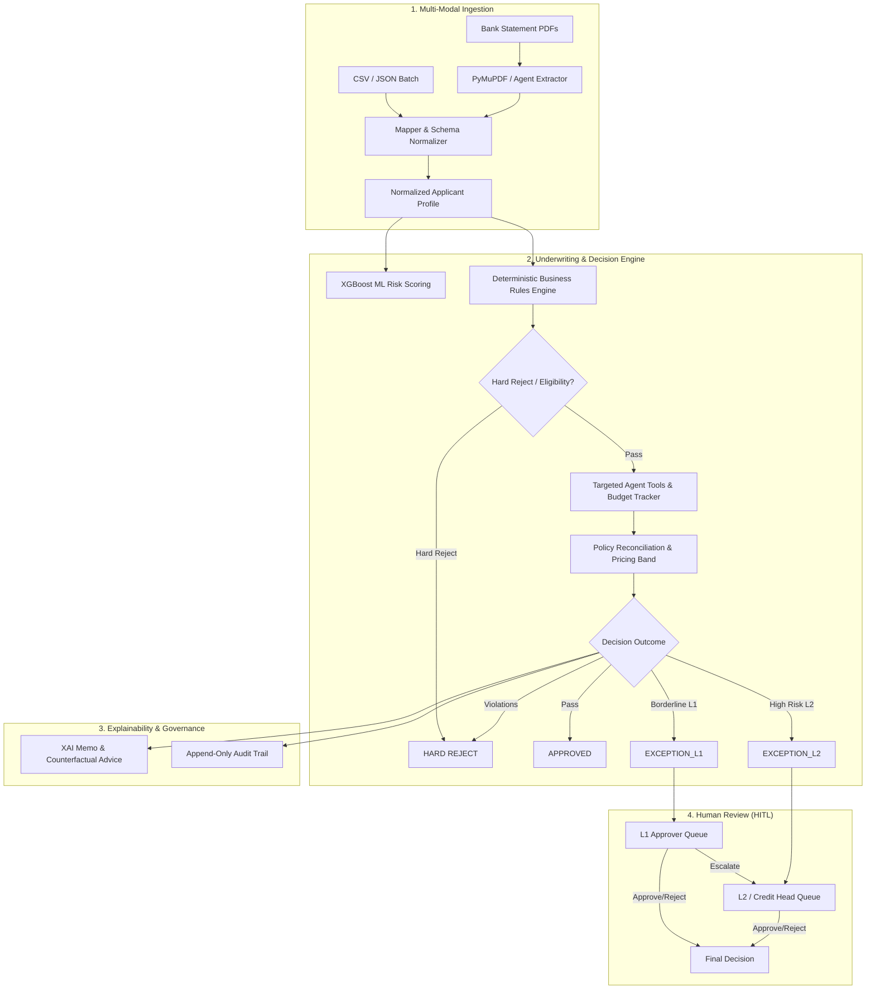

# 🏛️ Orizon — Smart Credit Underwriting & Configurable BRE

[](https://nextjs.org/)
[](https://react.dev/)
[](https://fastapi.tiangolo.com/)
[](https://python.org)
[](https://supabase.com/)
[](https://xgboost.readthedocs.io/)

> **Orizon** is an enterprise-grade, internal credit underwriting and Business Rules Engine (BRE) platform designed for Non-Banking Financial Companies (NBFCs). It transforms complex, heterogeneous applicant data (structured files & unstructured bank statement PDFs) into explainable, policy-backed credit decisions with human-in-the-loop exception escalation.

---

## 📑 Table of Contents

- [Key Features](#-key-features)
- [System Architecture](#-system-architecture)
- [Multi-Tier Role Hierarchy](#-multi-tier-role-hierarchy)
- [Decision Pipeline (Deterministic + AI)](#-decision-pipeline-deterministic--ai)
- [Tech Stack](#-tech-stack)
- [Project Structure](#-project-structure)
- [Getting Started](#-getting-started)
  - [Prerequisites](#prerequisites)
  - [1. Database Setup](#1-database-setup)
  - [2. AI Underwriting Engine (Python Backend)](#2-ai-underwriting-engine-python-backend)
  - [3. Web Application (Next.js Frontend)](#3-web-application-nextjs-frontend)
- [Environment Variables](#-environment-variables)
- [API Reference](#-api-reference)
- [Security & Governance](#-security--governance)

---

## 🌟 Key Features

### 1. ⚙️ Dynamic Business Rules Engine (BRE)
- **Zero-Downtime Policy Changes**: Credit policies, approval gates, and risk thresholds can be updated and toggled in real time via the Admin console without code deployments.
- **Hierarchical Gating**: Evaluates hard-reject gates, eligibility criteria, FOIR (Fixed Obligation to Income Ratio) ceilings, and pricing matrices deterministically.

### 2. 🤖 Hybrid Underwriting Pipeline (ML + Tools + XAI)
- **Calibrated ML Scoring**: Gradient-boosted scoring models (XGBoost) calculate empirical default probabilities, risk grades (P1–P5), and risk-adjusted pricing.
- **Targeted Intelligence Tools**: Tool catalog with strict budget governance (Macro Outlook, Adverse Media Checks, Employer Verification, Collateral Valuation, Peer Benchmarking).
- **Explainable AI (XAI)**: Generates human-readable decision memos, SHAP-derived feature contribution breakdowns, and actionable counterfactual advice for rejected/flagged applicants.

### 3. 📄 Multi-Modal Data Ingestion
- **Structured CSV / JSON Batch Processing**: Ingest single or multi-row applicant datasets with auto-aliasing and smart fallback schema mapping.
- **Unstructured PDF Parser**: Extracts financial metrics and transaction patterns from raw bank statement PDFs using PyMuPDF and LLM extraction.

### 4. 👥 2-Tier Human-in-the-Loop Exception Workflow
- Automatic routing of borderline cases to **L1 Approver** or **L2 / Credit Head** queues.
- Complete decision override capabilities with mandatory escalation reasoning and audit trails.

### 5. 🔒 Enterprise Security & Auditability
- Role-Based Access Control (RBAC) enforced via Supabase Row Level Security (RLS).
- Append-only audit logs tracking all evaluation runs, policy modifications, user invitations, and manual approvals.

---

## 🏛️ System Architecture



---

## 👥 Multi-Tier Role Hierarchy

| Role | Core Capabilities | Permissions & Boundaries |
| :--- | :--- | :--- |
| **Analyst** | Upload structured/PDF data, trigger underwriting runs, view decision reports and XAI memos | Read-only on rules; cannot approve exception cases |
| **L1 Approver** | Review and decide on `EXCEPTION_L1` cases; escalate complex files to L2 | Cannot edit BRE rules; cannot directly decide `EXCEPTION_L2` cases |
| **L2 / Credit Head** | Final human authority; review and decide on `EXCEPTION_L2` and escalated cases | Cannot edit BRE rules directly |
| **Admin** | Configure BRE rules & thresholds, invite users & assign roles, view system audit logs | Does not perform individual credit reviews |

---

## 💻 Tech Stack

### Frontend & UI
- **Framework**: [Next.js 16 (App Router)](https://nextjs.org/) + [React 19](https://react.dev/)
- **Styling**: [Tailwind CSS v4](https://tailwindcss.com/) + Class Variance Authority
- **Components**: [Radix UI / Base UI](https://base-ui.com/), [Lucide React Icons](https://lucide.dev/)
- **State & Data Fetching**: [Zustand](https://zustand-demo.pmnd.rs/), [TanStack React Query](https://tanstack.com/query), [React Hook Form](https://react-hook-form.com/) + [Zod](https://zod.dev/)
- **Visualizations**: [Recharts](https://recharts.org/)

### Backend & Underwriting Engine
- **Web API**: [FastAPI](https://fastapi.tiangolo.com/) with asynchronous background tasks and CORS middleware
- **Data Validation**: [Pydantic v2](https://docs.pydantic.dev/)
- **Machine Learning**: [XGBoost](https://xgboost.readthedocs.io/), [Scikit-Learn](https://scikit-learn.org/), [Pandas](https://pandas.pydata.org/), [Joblib](https://joblib.readthedocs.io/)
- **Document Processing**: [PyMuPDF (fitz)](https://pymupdf.readthedocs.io/)
- **LLM Reasoning & XAI**: [Groq SDK](https://groq.com/) (LLaMA 3.3 70B / 8B models)

### Database & Security
- **Database**: [PostgreSQL (Supabase)](https://supabase.com/)
- **Authentication**: Supabase Auth (Invite/Token based activation)
- **Security**: PostgreSQL Row Level Security (RLS) policies

---

## 📁 Project Structure

```text
Orizon/
├── ai/                              # Python AI Underwriting & BRE Service
│   ├── core/                        # Pydantic data schemas & state models
│   │   └── models.py                # Normalized profile, decision reports, budget
│   ├── engine/                      # Core decisioning pipeline
│   │   ├── core/
│   │   │   ├── orchestrator.py      # End-to-end pipeline orchestrator
│   │   │   └── xai.py               # SHAP & narrative generator
│   │   ├── ml/
│   │   │   └── model.py             # XGBoost scoring & policy engine
│   │   └── tools/                   # Market, macro, adverse media, verification tools
│   ├── ingestion/                   # Ingestion, schema mapping & PDF extractors
│   │   ├── mapper.py                # Schema mapping with alias dictionary
│   │   ├── pdf_processor.py         # Bank statement PDF extraction
│   │   └── reconciler.py            # Multi-source profile reconciler
│   ├── api.py                       # FastAPI entrypoint (/api/evaluate, /process/...)
│   └── requirements.txt             # Python dependencies
│
├── web/                             # Next.js Fullstack Web Application
│   ├── src/
│   │   ├── app/                     # Next.js App Router pages & server actions
│   │   │   ├── (auth)/              # Authentication (login, activate, setup)
│   │   │   ├── (dashboard)/         # Main views (overview, applications, queue, rules, audit)
│   │   │   └── actions/             # Server actions (evaluate, rules, users)
│   │   ├── components/              # UI components & dashboard widgets
│   │   │   ├── applications/        # Evaluation results, radar charts, file upload
│   │   │   ├── layout/              # Sidebar, headers, navigation
│   │   │   └── ui/                  # Reusable UI primitives
│   │   └── lib/                     # Supabase clients & utility helpers
│   ├── package.json                 # Frontend dependencies
│   └── tailwind.config.ts           # Design tokens & styling
│
├── database/                        # Database schemas and migrations
│   ├── schema.sql                   # Full Supabase PostgreSQL DDL schema
│   └── enable_rls.sql               # Row-Level Security policies
│
└── docs/                            # PRD, design system, and project context
```

---

## 🚀 Getting Started

### Prerequisites
- **Node.js**: `v18.18.0` or later
- **Python**: `3.10` to `3.13`
- **Package Managers**: `npm` or `pnpm` and `pip`
- **Supabase Account**: A free Supabase project for database and authentication

---

### 1. Database Setup

1. Log in to your [Supabase Console](https://app.supabase.com/) and create a new project.
2. Open the **SQL Editor** in Supabase.
3. Paste and execute the contents of [`database/schema.sql`](file:///c:/Users/Shubham%20Upadhyay/OneDrive/Desktop/CODING/Hackathon/Orizon/database/schema.sql).
4. Run [`database/enable_rls.sql`](file:///c:/Users/Shubham%20Upadhyay/OneDrive/Desktop/CODING/Hackathon/Orizon/database/enable_rls.sql) to apply security policies.

---

### 2. AI Underwriting Engine (Python Backend)

```powershell
# Navigate to the ai folder
cd ai

# Create and activate virtual environment
python -m venv .venv
.venv\Scripts\activate       # On Windows
# source .venv/bin/activate  # On Linux / macOS

# Install dependencies
pip install -r requirements.txt

# Start the FastAPI server
python api.py
```
> The API will start on **`http://localhost:8000`** with OpenAPI docs available at `http://localhost:8000/docs`.

---

### 3. Web Application (Next.js Frontend)

```powershell
# In a new terminal, navigate to the web folder
cd web

# Install npm dependencies
npm install

# Start the development server
npm run dev
```
> Open **`http://localhost:3000`** in your browser.

---

## 🔑 Environment Variables

### Web (`web/.env.local`)
Create a `.env.local` file inside the `web/` directory:

```env
# Supabase Configuration
NEXT_PUBLIC_SUPABASE_URL=https://your-project.supabase.co
NEXT_PUBLIC_SUPABASE_ANON_KEY=your-supabase-anon-key
SUPABASE_SERVICE_ROLE_KEY=your-supabase-service-role-key

# Python Underwriting API URL
PYTHON_API_URL=http://localhost:8000

# Next.js App URL
NEXT_PUBLIC_APP_URL=http://localhost:3000
```

### AI Engine (`ai/.env`)
Create a `.env` file inside the `ai/` directory (or rely on `web/.env.local` which is auto-loaded):

```env
# Supabase Configuration
SUPABASE_URL=https://your-project.supabase.co
SUPABASE_KEY=your-supabase-service-role-key

# Optional: Groq LLM API Key for XAI Narratives & Agentic Tools
GROQ_API_KEY=gsk_your_groq_api_key_here
```

---

## 📡 API Reference

### `POST /api/evaluate`
Executes complete underwriting evaluation for an applicant profile.

**Request Body:**
```json
{
  "profile": {
    "applicantId": "APP-2026-0891",
    "age": 34,
    "employmentType": "Salaried",
    "requestedLoanAmount": 750000,
    "requestedTenure": 36,
    "declaredIncome": 85000,
    "existingObligations": 18000,
    "bureauScore": 765,
    "bankAvgBalance": 45000,
    "bounceCount": 0,
    "writeOffFlag": false
  },
  "use_xai": true
}
```

**Response:**
```json
{
  "status": "success",
  "profile": { ... },
  "decision": {
    "applicant_id": "APP-2026-0891",
    "risk_grade": "P2",
    "max_eligible_amount": 750000.0,
    "interest_rate_band": "11.5% - 13.0%",
    "policy_result": {
      "final_decision": "APPROVED",
      "final_score": 78.4,
      "triggered_rules": []
    },
    "xai_narrative": "Applicant exhibits prime creditworthiness with strong FOIR margin (21.2%) and spotless repayment history."
  }
}
```

### `POST /process/structured`
Upload CSV or JSON files for bulk applicant ingestion and validation.

### `POST /process/unstructured`
Upload PDF bank statements for automated feature extraction.

---

## 🛡️ Security & Governance

- **Deterministic Core**: AI never makes unmonitored decisions. The deterministic Business Rules Engine retains final decision authority.
- **Budget Enforced**: API budgets strictly limit LLM and external search calls to prevent cost spikes and latency degradation.
- **Integrity Verified**: Every decision records an immutable audit log linking inputs, triggered rules, and final authority signatures.

---

## 📄 License
This project was developed for the **CODEISSANCE 2026** Hackathon (Problem Statement: *Smart Credit Underwriting & Configurable BRE for NBFC*). Internal use only.
