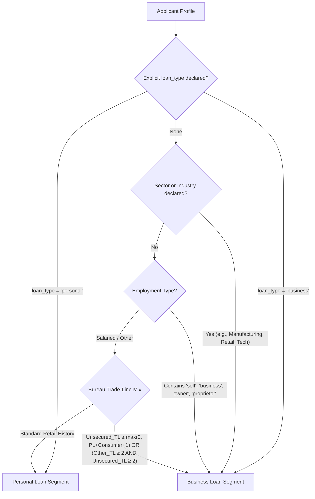
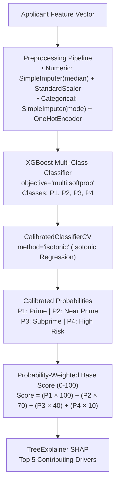
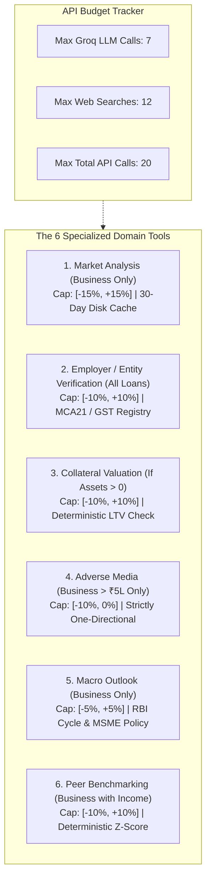
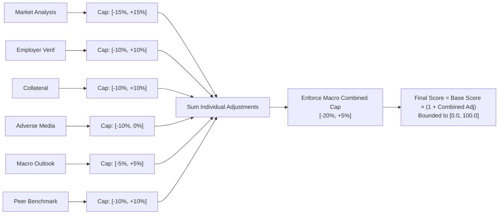
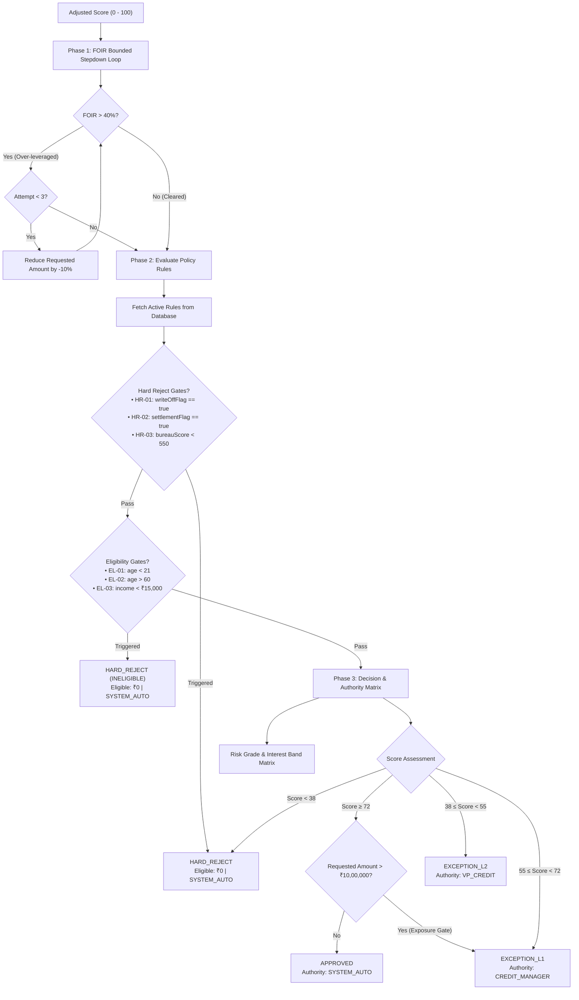
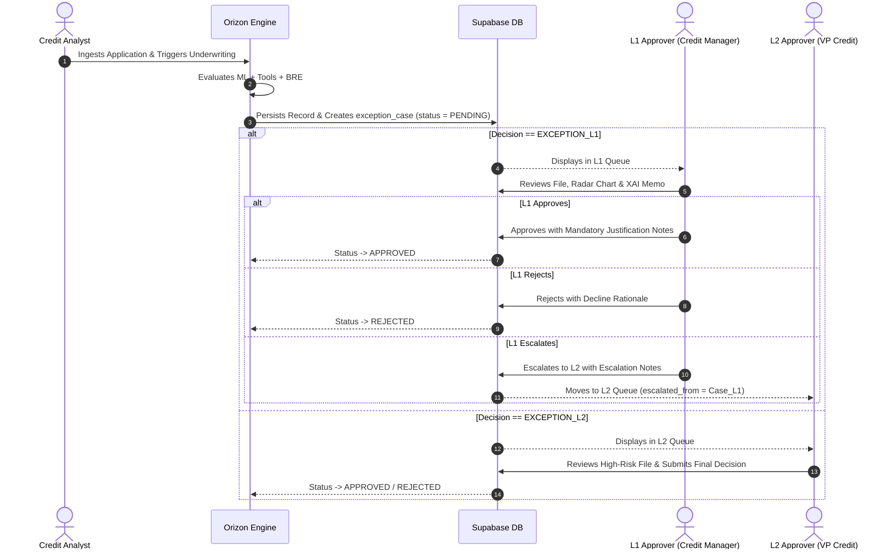
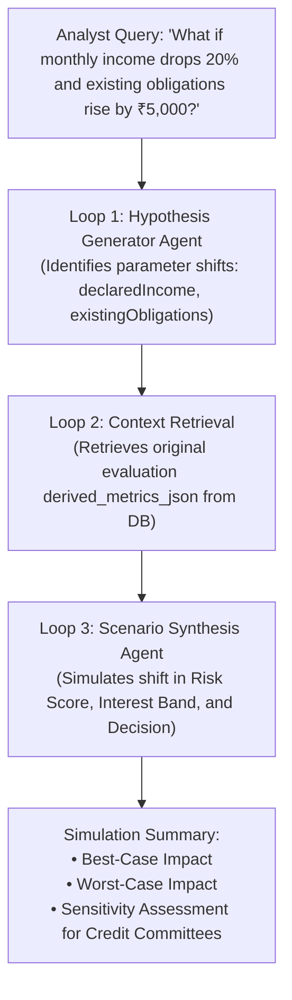
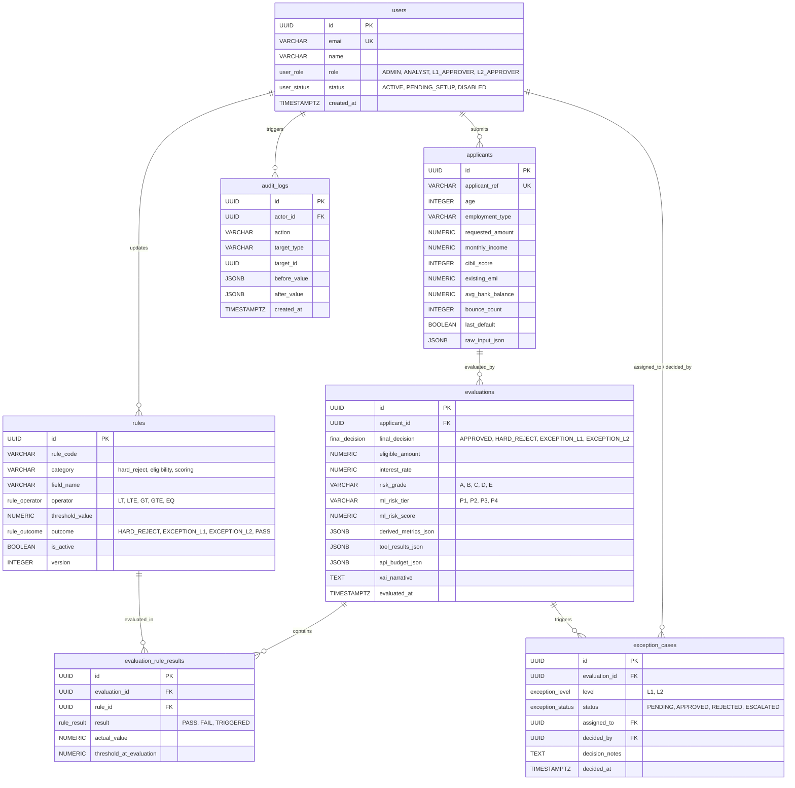

# 🏛️ Orizon — Smart Credit Underwriting & Autonomous Configurable BRE

[](https://nextjs.org/)
[](https://react.dev/)
[](https://fastapi.tiangolo.com/)
[](https://python.org)
[](https://supabase.com/)
[](https://xgboost.readthedocs.io/)
[](https://groq.com/)

> **Orizon** is an enterprise-grade credit underwriting and Business Rules Engine (BRE) platform designed for Non-Banking Financial Companies (NBFCs). It resolves the modern credit dilemma—balancing **rapid digital automation** with **strict regulatory governance**—by pairing dual calibrated machine-learning models and budget-governed AI agents with a deterministic, policy-backed rules engine and a 2-tier human-in-the-loop exception workflow.

---

## 📑 Table of Contents

- [Executive Summary & Core Philosophy](#executive-summary-core-philosophy)
- [System Architecture](#system-architecture)
- [Multi-Modal Ingestion & Local PII Protection](#multi-modal-ingestion-local-pii-protection)
- [Loan Segmentation Engine (Personal vs. Business)](#loan-segmentation-engine-personal-vs-business)
- [Machine Learning Model Specifications](#machine-learning-model-specifications)
- [Autonomous Agentic Orchestrator & Tool Catalog](#autonomous-agentic-orchestrator-tool-catalog)
- [Deterministic Business Rules Engine (BRE) & Pricing](#deterministic-business-rules-engine-bre-pricing)
- [System Guardrails & Regulatory Governance](#system-guardrails-regulatory-governance)
- [Human-in-the-Loop (HITL) Exception Management](#human-in-the-loop-hitl-exception-management)
- [Interactive What-If Scenario Simulator](#interactive-what-if-scenario-simulator)
- [Database Schema & Security Architecture](#database-schema-security-architecture)
- [Tech Stack](#tech-stack)
- [Project Directory Structure](#project-directory-structure)
- [Getting Started](#getting-started)
- [Environment Variables](#environment-variables)
- [API Reference](#api-reference)
- [License](#license)

---

<a id="executive-summary-core-philosophy"></a><a id="executive-summary--core-philosophy"></a>
## 💡 Executive Summary & Core Philosophy

Traditional loan origination systems suffer from two extremes: **rigid manual underwriting** that causes multi-day turnaround times, or **opaque black-box AI** that violates regulatory compliance and hallucinate risk assessments. 

Orizon implements a **governed hybrid architecture**:
1. **Deterministic Core Authority**: AI agents and machine-learning models provide calibrated scoring, adverse risk screening, and market context, but **never make unmonitored lending decisions**. Final decision authority is strictly held by the deterministic Business Rules Engine (BRE).
2. **Zero-Downtime Policy Agility**: Credit policies, approval gates, and risk thresholds are stored in PostgreSQL (Supabase) and can be toggled or reconfigured dynamically via the Admin UI without code redeployments.
3. **Specialized Loan Bifurcation**: Salaried retail borrowers and MSME enterprises are automatically bifurcated into specialized scoring pipelines with distinct risk drivers.
4. **Strict API Budget Governance**: Agentic loops run under enforced API ceilings (Max 7 LLM calls, 12 Web searches, 20 total API calls per evaluation run) to guarantee predictable latency and zero cost runaway.
5. **Local Privacy-Preserving Computing**: All PII (PAN, Aadhaar, Names, Accounts) is masked locally using Presidio tokenization before any prompt touches an external LLM, and rehydrated locally in-memory afterwards.

---

<a id="system-architecture"></a>
## 🏛️ System Architecture


```mermaid
flowchart TD
    %% INGESTION LAYER
    subgraph S1["1. Multi-Modal Ingestion & Normalization"]
        direction TB
        IN_CSV["Structured Data\n(CSV / JSON Batch)"]
        IN_PDF["Bank Statement PDFs\n& Financial Docs"]
        IN_FORM["Manual Entry\n(Analyst Portal)"]

        MAP["Smart Schema Mapper\n(Alias Dictionary + Normalizer)"]
        PII["Presidio PII Masker\n(Local Tokenization)"]
        EXT_PDF["Hybrid PDF Extractor\n(PyMuPDF + Groq LLM + Regex)"]
        BANK_PARSER["Bank Statement Aggregator\n(Avg Bal, Monthly Credits, EMI, Bounces)"]
        REC["Multi-Source Profile Reconciler"]

        IN_CSV --> MAP
        IN_FORM --> MAP
        IN_PDF --> PII --> EXT_PDF
        IN_PDF --> BANK_PARSER
        
        MAP --> REC
        EXT_PDF --> REC
        BANK_PARSER --> REC
        
        NORM["NormalizedApplicantProfile\n(Standardized Pydantic Model)"]
        REC --> NORM
    end

    %% SEGMENTATION LAYER
    subgraph S2["2. Loan Classification & Segmentation Engine"]
        direction TB
        NORM --> INFER{"_infer_loan_type()\nLoan Type Inference"}
        INFER -->|"Explicit tag OR Salaried\nRetail trade-line mix"| PERSONAL["Personal Loan Flow"]
        INFER -->|"Explicit tag OR Sector declared\nSelf-employed / Unsecured-heavy mix"| BUSINESS["Business Loan Flow"]
    end

    %% STAGE 1: ML SCORING
    subgraph S3["3. Stage 1: Calibrated XGBoost ML Scoring (0 API Calls)"]
        direction TB
        PERSONAL --> ML_PL["personal_loan_xgb_v1\nCalibratedClassifierCV (Isotonic)\nXGBoost Multi-Class"]
        BUSINESS --> ML_BL["business_loan_xgb_v1\nCalibratedClassifierCV (Isotonic)\nXGBoost Multi-Class"]
        
        ML_PL --> PROBS["Calibrated Risk Tier Probabilities\n(P1, P2, P3, P4)"]
        ML_BL --> PROBS
        
        PROBS --> SCORE_ANCHOR["Probability-Weighted Base Score (0-100)\nScore = Sum(Prob_i × Anchor_i)\nP1: 100 | P2: 70 | P3: 40 | P4: 10"]
        SCORE_ANCHOR --> SHAP_EXP["TreeExplainer SHAP\n(Top 5 Contributing Drivers)"]
    end

    %% STAGE 2: TOOL CATALOG
    subgraph S4["4. Stage 2: Autonomous Agentic Orchestrator (Budget Governed)"]
        direction TB
        BUDGET["API Budget Enforcer\nGroq LLM: ≤7 | Web Search: ≤12 | Total: ≤20"]
        ORCH["Orchestrator Agent Loop\n(Max 3 Iterative Reasoning Loops)"]
        
        BUDGET -.-> ORCH
        SHAP_EXP --> ORCH
        
        ORCH --> T_EMP["Employer / Entity Verification [±10%]\n• Salaried Employer Check (Personal)\n• MCA21 / GST Registry (Business)"]
        ORCH --> T_COL["Collateral Valuation [±10%]\n• Deterministic LTV Mathematical Check"]
        
        ORCH -->|"Business Loans ONLY"| T_MKT["Market / Sector Analysis [±15%]\n• Industry sector outlook & credit risk"]
        ORCH -->|"Business Loans > ₹5L ONLY"| T_MED["Adverse Media Screen [-10% to 0%]\n• Regulatory, NCLT, Fraud (One-Directional)"]
        ORCH -->|"Business Loans ONLY"| T_MAC["Macro Outlook [±5%]\n• RBI repo cycle, MSME policy"]
        ORCH -->|"Business Loans ONLY"| T_PEER["Peer Benchmarking [±10%]\n• Statistical Z-score vs 10 Sector Medians"]
    end

    %% STAGE 3: AGGREGATION
    subgraph S5["5. Stage 3: Tool Adjustment Aggregation & Clamping"]
        direction TB
        T_EMP & T_COL & T_MKT & T_MED & T_MAC & T_PEER --> AGG["aggregate_adjustments()\nSum Clamped Per-Tool Adjustments"]
        AGG --> CLAMP["Enforce Asymmetric Macro Cap\nCombined Ceiling: [-20%, +5%]"]
        CLAMP --> ADJ_SCORE["Adjusted Score =\nBase Score × (1 + Combined Adj)\nBounded to [0.0, 100.0]"]
    end

    %% STAGE 4: BRE & POLICY
    subgraph S6["6. Stage 4: Deterministic Policy Engine (BRE)"]
        direction TB
        ADJ_SCORE --> FOIR_LOOP{"FOIR Bounded Stepdown\nDebt / Income > 40%?"}
        FOIR_LOOP -->|"Yes"| FOIR_RETRY["Step down loan amount by -10%\n(Up to 3 attempts)"]
        FOIR_RETRY --> FOIR_LOOP
        FOIR_LOOP -->|"No / Cleared / Exhausted"| BRE_EVAL["Evaluate Active Rules from DB"]
        
        BRE_EVAL --> G1{"Hard Reject Gates?\n• Prior Write-off (HR-01)\n• Prior Settlement (HR-02)\n• CIBIL < 550 (HR-03)"}
        G1 -->|"Violated"| RES_HR["HARD_REJECT\nEligible Amount: ₹0\nAuthority: SYSTEM_AUTO"]
        
        G1 -->|"Pass"| G2{"Eligibility Gates?\n• Age < 21 (EL-01)\n• Age > 60 (EL-02)\n• Income < ₹15,000 (EL-03)"}
        G2 -->|"Violated"| RES_INELIG["HARD_REJECT (INELIGIBLE)\nEligible Amount: ₹0\nAuthority: SYSTEM_AUTO"]
        
        G2 -->|"Pass"| G3{"Score & Exposure Thresholds\nApprove: ≥72 | L1: ≥55 | L2: ≥38"}
        G3 -->|"Score ≥ 72 & Amount ≤ ₹10L"| RES_APP["APPROVED\nAuthority: SYSTEM_AUTO"]
        G3 -->|"Score ≥ 72 & Amount > ₹10L"| RES_L1["EXCEPTION_L1\nAuthority: CREDIT_MANAGER"]
        G3 -->|"55 ≤ Score < 72"| RES_L1
        G3 -->|"38 ≤ Score < 55"| RES_L2["EXCEPTION_L2\nAuthority: VP_CREDIT"]
        G3 -->|"Score < 38"| RES_HR
        
        G3 --> PRICING["Risk Grade & Pricing Band Matrix\nGrade A (82+): 10-12% | Grade B (70-81): 12-14%\nGrade C (55-69): 14-18% | Grade D (38-54): 18-24%\nGrade E (<38): 24%+"]
    end

    %% STAGE 5: XAI & AUDIT
    subgraph S7["7. Stage 5: Explainability, Auditing & Persistence"]
        direction TB
        RES_APP & RES_L1 & RES_L2 & RES_HR & RES_INELIG --> XAI["XAI Generator (Groq LLM)\nStrict JSON: Concise Narrative +\nActionable Counterfactual Guidance"]
        XAI --> AUDIT_JSONL["Append-Only JSONL Audit Trail\n(experiments/pipeline_runs.jsonl)"]
        XAI --> DB_SAVE["Supabase PostgreSQL Persistence\n• applicants & evaluations\n• evaluation_rule_results\n• exception_cases & audit_logs"]
    end

    %% STAGE 6: HITL EXCEPTION QUEUE
    subgraph S8["8. Human-in-the-Loop (HITL) Exception Management"]
        direction TB
        DB_SAVE --> ROUTE{"Exception Status"}
        ROUTE -->|"EXCEPTION_L1"| Q_L1["L1 Approver Queue\n(Credit Manager)"]
        ROUTE -->|"EXCEPTION_L2"| Q_L2["L2 Approver Queue\n(VP Credit / Credit Head)"]
        
        Q_L1 -->|"Approve / Reject"| FINAL_DEC["Final Disbursal / Decline"]
        Q_L1 -->|"Escalate File"| Q_L2
        Q_L2 -->|"Final Sign-off"| FINAL_DEC
        
        SIM["What-If Scenario Simulator\n(Interactive Parameter Sensitivity)"] -.-> Q_L1
        SIM -.-> Q_L2
    end
```

---

<a id="multi-modal-ingestion-local-pii-protection"></a><a id="multi-modal-ingestion--local-pii-protection"></a>
## 📄 Multi-Modal Ingestion & Local PII Protection

Orizon ingests both batch structured records and unstructured documents, reconciling them into a unified, validated [`NormalizedApplicantProfile`](file:///d:/Anoop/Code/projects/Orizon/ai/core/models.py):

### 1. Structured Batch Ingestion (CSV / JSON)
- **Synonym Aliasing Dictionary**: Maps heterogeneous column headers (`monthly_salary`, `net_credits`, `take_home_pay`, `gross_income`) to canonical Pydantic model attributes in [`mapper.py`](file:///d:/Anoop/Code/projects/Orizon/ai/ingestion/mapper.py).
- **Type Coercion & Cleansing**: Strips currency glyphs (₹, $, commas), handles `-99999` sentinel values, and converts string booleans.

### 2. Unstructured Bank Statement & Document Ingestion (PDF)
- **Hybrid Extraction Pipeline**:
  1. **Local PyMuPDF Extraction**: Extracts raw text blocks directly in-memory.
  2. **Deterministic Regex Engine**: A specialized regex extractor in [`pdf_processor.py`](file:///d:/Anoop/Code/projects/Orizon/ai/ingestion/pdf_processor.py) parses standard Indian banking and credit artifacts (PAN numbers, CIBIL scores, net pay, EMI debit entries, average balances, bounce returns, and write-offs).
  3. **Local Presidio PII Masker**: Scans text for identity entities (Names, PANs, Aadhaar, account numbers, addresses) and replaces them with secure temporary surrogate tokens (`<<IN_PAN_1>>`, `<<PERSON_1>>`).
  4. **Deep Context LLM Extraction (Groq)**: The masked text (up to 35,000 characters) is analyzed by Groq in strict JSON format.
  5. **Local Rehydration**: Extracted values are mapped back to their original values locally in memory. The surrogate mapping table is deleted from RAM immediately.
- **Mathematical Cash-Flow Metrics**:
  - `bankAvgBalance`: Daily closing balance mean across all statement months.
  - `monthlyCredits`: Sum of monthly deposit entries (gross cash inflow).
  - `emiDebits`: Median recurring withdrawals matching loan narrations (`emi|loan|finance|auto debit`).
  - `bounceCount`: Total frequency of dishonored cheques/ECS (`return|bounce|rtn|insufficient`).
  - `cashFlowVolatility`: Standard deviation of monthly deposits.

---

<a id="loan-segmentation-engine-personal-vs-business"></a>
## 🔀 Loan Segmentation Engine (Personal vs. Business)

Credit dynamics differ fundamentally between personal and commercial loans. Orizon automatically classifies each applicant:


```mermaid
flowchart TD
    START["Applicant Profile"] --> CHECK_TAG{"Explicit loan_type declared?"}
    CHECK_TAG -->|"loan_type = 'personal'"| PL["Personal Loan Segment"]
    CHECK_TAG -->|"loan_type = 'business'"| BL["Business Loan Segment"]
    
    CHECK_TAG -->|"None"| CHECK_SECTOR{"Sector or Industry declared?"}
    CHECK_SECTOR -->|"Yes (e.g., Manufacturing, Retail, Tech)"| BL
    
    CHECK_SECTOR -->|"No"| CHECK_EMP{"Employment Type?"}
    CHECK_EMP -->|"Contains 'self', 'business', 'owner', 'proprietor'"| BL
    
    CHECK_EMP -->|"Salaried / Other"| CHECK_TL{"Bureau Trade-Line Mix"}
    CHECK_TL -->|"Unsecured_TL ≥ max(2, PL+Consumer+1) OR (Other_TL ≥ 2 AND Unsecured_TL ≥ 2)"| BL
    CHECK_TL -->|"Standard Retail History"| PL
```

### Side-by-Side Comparison

| Dimension | Personal Loan Path | Business Loan Path | Code Location |
| :--- | :--- | :--- | :--- |
| **Target Borrower** | Salaried employees & retail consumers | Self-employed, proprietors, MSMEs | [`_infer_loan_type()`](file:///d:/Anoop/Code/projects/Orizon/ai/engine/ml/model.py) |
| **ML Model Artifact** | `personal_loan_xgb_v1.pkl` | `business_loan_xgb_v1.pkl` | [`train_models.py`](file:///d:/Anoop/Code/projects/Orizon/ai/engine/ml/train_models.py) |
| **Primary Risk Drivers** | Net Salary, Bureau Score, DPD History, Inquiries | Revenue, Vintage, Cash Volatility, Trade-Line Mix | [`model.py`](file:///d:/Anoop/Code/projects/Orizon/ai/engine/ml/model.py) |
| **Market / Sector Analysis** | **Skipped** (`skip_reason: "personal loan"`) | **Executed** (Sector default outlook; cap: $\pm 15\%$) | [`market_agent.py`](file:///d:/Anoop/Code/projects/Orizon/ai/engine/tools/market_agent.py) |
| **Entity Verification** | Verifies employer identity & job tenure | Verifies incorporation via MCA21 / GST registry | [`employer_verification.py`](file:///d:/Anoop/Code/projects/Orizon/ai/engine/tools/employer_verification.py) |
| **Adverse Media Screening** | **Skipped** (Personal / below threshold) | **Executed if loan > ₹5 Lakhs** (Cap: $-10\%$ to $0\%$) | [`adverse_media.py`](file:///d:/Anoop/Code/projects/Orizon/ai/engine/tools/adverse_media.py) |
| **Macro Outlook** | **Skipped** (`skip_reason: "personal loan"`) | **Executed** (RBI repo cycle & MSME policy; cap: $\pm 5\%$) | [`macro_outlook.py`](file:///d:/Anoop/Code/projects/Orizon/ai/engine/tools/macro_outlook.py) |
| **Peer Benchmarking** | **Skipped** | **Executed** (Z-score vs 10 sector medians; cap: $\pm 10\%$) | [`peer_benchmarking.py`](file:///d:/Anoop/Code/projects/Orizon/ai/engine/tools/peer_benchmarking.py) |
| **Collateral Valuation** | Executed if retail assets declared (LTV check) | Executed if commercial assets declared (LTV check) | [`collateral_valuation.py`](file:///d:/Anoop/Code/projects/Orizon/ai/engine/tools/collateral_valuation.py) |
| **FOIR Debt Limit** | $40\%$ ceiling on monthly take-home salary | $40\%$ ceiling on net business earnings | [`ml_config.py`](file:///d:/Anoop/Code/projects/Orizon/ai/engine/config/ml_config.py) |
| **Max Eligible Cap** | $\min(\text{Monthly Income} \times 5.0, \; ₹50,00,000)$ | $\min(\text{Monthly Income} \times 5.0, \; ₹50,00,000)$ | [`_max_eligible_amount()`](file:///d:/Anoop/Code/projects/Orizon/ai/engine/ml/model.py) |

---

<a id="machine-learning-model-specifications"></a>
## 🤖 Machine Learning Model Specifications

Stage 1 runs entirely in-memory using Scikit-Learn and XGBoost (**zero external API calls**, $\approx 15\text{ms}$ execution latency):


```mermaid
graph TD
    DATA["Applicant Feature Vector"] --> PIPE["Preprocessing Pipeline\n• Numeric: SimpleImputer(median) + StandardScaler\n• Categorical: SimpleImputer(mode) + OneHotEncoder"]
    
    PIPE --> XGB["XGBoost Multi-Class Classifier\nobjective='multi:softprob'\nClasses: P1, P2, P3, P4"]
    
    XGB --> CALIB["CalibratedClassifierCV\nmethod='isotonic' (Isotonic Regression)"]
    
    CALIB --> TIER_PROBS["Calibrated Probabilities\nP1: Prime | P2: Near Prime\nP3: Subprime | P4: High Risk"]
    
    TIER_PROBS --> CALC_SCORE["Probability-Weighted Base Score (0-100)\nScore = (P1 × 100) + (P2 × 70) + (P3 × 40) + (P4 × 10)"]
    
    CALC_SCORE --> SHAP_EXP["TreeExplainer SHAP\nTop 5 Contributing Drivers"]
```

### Model Architecture & Specs

| Parameter | Specification |
| :--- | :--- |
| **Algorithm** | Multi-Class Gradient Boosted Decision Trees (`XGBClassifier`) |
| **Objective Function** | `multi:softprob` with `eval_metric="mlogloss"` |
| **Probability Calibration** | `CalibratedClassifierCV` via **Isotonic Regression** fitted on held-out validation data |
| **Target Classes** | 4 Risk Tiers: `P1` (Prime), `P2` (Near-Prime), `P3` (Subprime), `P4` (High Risk / Default Prone) |
| **Hyperparameter Tuning** | `RandomizedSearchCV` (40 iterations, 5-fold stratified cross-validation, optimized for `f1_macro`) |
| **Search Space** | `n_estimators`: `[150, 250, 350, 500]`<br>`max_depth`: `[3, 4, 5, 6]`<br>`learning_rate`: `[0.02, 0.04, 0.06, 0.08, 0.10]`<br>`subsample`: `[0.75, 0.85, 1.0]`<br>`colsample_bytree`: `[0.75, 0.85, 1.0]`<br>`min_child_weight`: `[1, 3, 5]` |
| **Feature Pipeline** | - Missing value threshold: Drop columns with $> 20\%$ missing ratio<br>- Numeric features: `SimpleImputer(strategy="median")` + `StandardScaler()`<br>- Categorical features: `SimpleImputer(strategy="most_frequent")` + `OneHotEncoder(handle_unknown="ignore")` |
| **Explainability** | SHAP `TreeExplainer` decomposes predictions into individual feature attribution values ($\phi_i$) |

### Risk Tier Anchors & Scoring Formula

Rather than a crude binary probability, Orizon computes an expected creditworthiness score calibrated from 0 to 100:

$$\text{Base Risk Score} = \sum_{i \in \{P1, P2, P3, P4\}} \left( P(\text{Tier}_i) \times \text{Anchor}_i \right)$$

- **Tier P1 (Prime)**: Anchor Score = `100.0`
- **Tier P2 (Near-Prime)**: Anchor Score = `70.0`
- **Tier P3 (Subprime)**: Anchor Score = `40.0`
- **Tier P4 (High Risk / Default Prone)**: Anchor Score = `10.0`

---

<a id="autonomous-agentic-orchestrator-tool-catalog"></a><a id="autonomous-agentic-orchestrator--tool-catalog"></a>
## 🧭 Autonomous Agentic Orchestrator & Tool Catalog

Underwriting Stage 2 employs an autonomous Orchestrator Agent that dynamically decides which data-enrichment tools to invoke across up to **3 iterative reasoning loops**:


```mermaid
graph TD
    subgraph BudgetControl["API Budget Tracker"]
        B1["Max Groq LLM Calls: 7"]
        B2["Max Web Searches: 12"]
        B3["Max Total API Calls: 20"]
    end

    subgraph ToolCatalog["The 6 Specialized Domain Tools"]
        T1["1. Market Analysis (Business Only)\nCap: [-15%, +15%] | 30-Day Disk Cache"]
        T2["2. Employer / Entity Verification (All Loans)\nCap: [-10%, +10%] | MCA21 / GST Registry"]
        T3["3. Collateral Valuation (If Assets > 0)\nCap: [-10%, +10%] | Deterministic LTV Check"]
        T4["4. Adverse Media (Business > ₹5L Only)\nCap: [-10%, 0%] | Strictly One-Directional"]
        T5["5. Macro Outlook (Business Only)\nCap: [-5%, +5%] | RBI Cycle & MSME Policy"]
        T6["6. Peer Benchmarking (Business with Income)\nCap: [-10%, +10%] | Deterministic Z-Score"]
    end

    BudgetControl -.-> ToolCatalog
```

### The 6 Specialized Domain Tools

1. **Market & Sector Analysis (`market_analysis`)**:
   - Analyzes industry default trends and MSME credit risk in India.
   - Enforces a 30-day persistent disk cache (`market_cache.json`) to minimize redundant queries.
   - **Bounds**: $[-15\%, +15\%]$.
2. **Employer & Entity Verification (`employer_verification`)**:
   - For Personal Loans: Checks employer legitimacy, listing status, and employee tenure.
   - For Business Loans: Verifies registration, incorporation vintage, and compliance via MCA21 / GST records.
   - **Bounds**: $[-10\%, +10\%]$.
3. **Collateral Valuation (`collateral_valuation`)**:
   - Deterministic Loan-to-Value (LTV) verification against declared property, mutual funds, or demat holdings.
   - Only executed if applicant declares assets $> 0$.
   - **Bounds**: $[-10\%, +10\%]$.
4. **Adverse Media Screening (`adverse_media`)**:
   - Searches regulatory databases for NCLT proceedings, winding-up petitions, willful defaults, and financial fraud.
   - Only executed on business loans $> ₹5,00,000$.
   - **Strictly One-Directional**: Bounds are $[-10\%, 0\%]$. Negative news reduces the borrower's score, but absence of negative news never boosts creditworthiness.
5. **Macroeconomic Outlook (`macro_outlook`)**:
   - Assesses RBI repo rate cycle, liquidity pressures, and sector-specific government subsidies.
   - **Bounds**: $[-5\%, +5\%]$.
6. **Peer Benchmarking (`peer_benchmarking`)**:
   - Deterministically calculates a statistical Z-score comparing the applicant's revenue and business vintage against 10 Indian sector baselines:
     $$\text{Z-Score} = \frac{\text{Revenue} - \mu_{\text{sector}}}{\sigma_{\text{sector}}}$$
   - **Bounds**: $[-10\%, +10\%]$.

### Tool Adjustment Aggregation & Asymmetric Ceiling


```mermaid
flowchart LR
    T1["Market Analysis"] --> CLAMP1["Cap: [-15%, +15%]"]
    T2["Employer Verif"] --> CLAMP2["Cap: [-10%, +10%]"]
    T3["Collateral"] --> CLAMP3["Cap: [-10%, +10%]"]
    T4["Adverse Media"] --> CLAMP4["Cap: [-10%, 0%]"]
    T5["Macro Outlook"] --> CLAMP5["Cap: [-5%, +5%]"]
    T6["Peer Benchmark"] --> CLAMP6["Cap: [-10%, +10%]"]

    CLAMP1 & CLAMP2 & CLAMP3 & CLAMP4 & CLAMP5 & CLAMP6 --> SUM["Sum Individual Adjustments"]
    
    SUM --> COMBINED_CLAMP["Enforce Macro Combined Cap\n[-20%, +5%]"]
    
    COMBINED_CLAMP --> FINAL_SCORE["Final Score = Base Score × (1 + Combined Adj)\nBounded to [0.0, 100.0]"]
```

> [!IMPORTANT]
> **Asymmetric Ceiling Guardrail**: Compounding adverse findings can penalize an applicant by up to **$-20\%$**, but compounding positive signals can only boost the score by up to **$+5\%$**. This prevents generative AI tools from inflating subprime borrowers into approvals.

---

<a id="deterministic-business-rules-engine-bre-pricing"></a><a id="deterministic-business-rules-engine-bre--pricing"></a>
## ⚖️ Deterministic Business Rules Engine (BRE) & Pricing

The Business Rules Engine in [`model.py`](file:///d:/Anoop/Code/projects/Orizon/ai/engine/ml/model.py) evaluates credit applications in 3 deterministic phases:


```mermaid
flowchart TD
    SCORE["Adjusted Score (0 - 100)"] --> P1["Phase 1: FOIR Bounded Stepdown Loop"]
    
    P1 --> FOIR_CHECK{"FOIR > 40%?"}
    FOIR_CHECK -->|"Yes (Over-leveraged)"| STEPDOWN{"Attempt < 3?"}
    STEPDOWN -->|"Yes"| REDUCE["Reduce Requested Amount by -10%"]
    REDUCE --> FOIR_CHECK
    STEPDOWN -->|"No"| P2["Phase 2: Evaluate Policy Rules"]
    FOIR_CHECK -->|"No (Cleared)"| P2

    P2 --> EVAL_RULES["Fetch Active Rules from Database"]
    
    EVAL_RULES --> GATE_HR{"Hard Reject Gates?\n• HR-01: writeOffFlag == true\n• HR-02: settlementFlag == true\n• HR-03: bureauScore < 550"}
    GATE_HR -->|"Triggered"| OUT_HR["HARD_REJECT\nEligible: ₹0 | SYSTEM_AUTO"]

    GATE_HR -->|"Pass"| GATE_ELIG{"Eligibility Gates?\n• EL-01: age < 21\n• EL-02: age > 60\n• EL-03: income < ₹15,000"}
    GATE_ELIG -->|"Triggered"| OUT_INELIG["HARD_REJECT (INELIGIBLE)\nEligible: ₹0 | SYSTEM_AUTO"]

    GATE_ELIG -->|"Pass"| P3["Phase 3: Decision & Authority Matrix"]

    P3 --> SCORE_DECIDE{"Score Assessment"}
    SCORE_DECIDE -->|"Score ≥ 72"| AMT_CHECK{"Requested Amount > ₹10,00,000?"}
    AMT_CHECK -->|"No"| DEC_APPROVED["APPROVED\nAuthority: SYSTEM_AUTO"]
    AMT_CHECK -->|"Yes (Exposure Gate)"| DEC_L1["EXCEPTION_L1\nAuthority: CREDIT_MANAGER"]
    
    SCORE_DECIDE -->|"55 ≤ Score < 72"| DEC_L1
    SCORE_DECIDE -->|"38 ≤ Score < 55"| DEC_L2["EXCEPTION_L2\nAuthority: VP_CREDIT"]
    SCORE_DECIDE -->|"Score < 38"| OUT_HR

    P3 --> PRICING["Risk Grade & Interest Band Matrix"]
```

### Risk Grade & Pricing Matrix

| Score Range | Risk Grade | Risk Tier | Interest Rate Band | Approval Action & Authority |
| :---: | :---: | :---: | :---: | :--- |
| **82.0 – 100.0** | **A** | P1 | **10.0% – 12.0%** | Auto-Approve (`SYSTEM_AUTO`, if $\le$ ₹10L) |
| **70.0 – 81.9** | **B** | P1/P2 | **12.0% – 14.0%** | Auto-Approve (if $\ge 72$ & $\le$ ₹10L) |
| **55.0 – 69.9** | **C** | P2/P3 | **14.0% – 18.0%** | Escalate to L1 Approver (`CREDIT_MANAGER`) |
| **38.0 – 54.9** | **D** | P3/P4 | **18.0% – 24.0%** | Escalate to L2 Approver / VP Credit (`VP_CREDIT`) |
| **0.0 – 37.9** | **E** | P4 | **24.0%+** (Declined) | System Auto-Reject (`SYSTEM_AUTO`) |

---

<a id="system-guardrails-regulatory-governance"></a><a id="system-guardrails--regulatory-governance"></a>
## 🛡️ System Guardrails & Regulatory Governance

Orizon enforces multi-layered regulatory guardrails across the entire evaluation lifecycle:

```text
[Multi-Modal Ingestion]
        │
        ▼ 🛡️ Guardrail 1: Local Presidio PII Masking (Tokens in transit, zero identity leakage)
[ML Scoring Stage]
        │
        ▼ 🛡️ Guardrail 2: Deterministic Baseline Calibration (0 external API calls, pure in-memory)
[Agentic Orchestrator]
        │
        ▼ 🛡️ Guardrail 3: Hard API Budget Caps (Max 7 LLMs, 12 Searches, 20 Total Calls)
[Tool Adjustments]
        │
        ▼ 🛡️ Guardrail 4: Asymmetric Tool Caps (Adverse media one-directional; [-20%, +5%] macro cap)
[BRE Policy Engine]
        │
        ▼ 🛡️ Guardrail 5: FOIR Bounded Stepdown (Max 3 retries at -10% step)
        │
        ▼ 🛡️ Guardrail 6: Deterministic Policy Authority (AI cannot approve; BRE has final veto)
[Post-Decision Layer]
        │
        ▼ 🛡️ Guardrail 7: 2-Tier HITL Human Escalation & Immutable Audit Logging
```

1. **Deterministic Authority Guardrail**: AI agents and LLMs provide context and adjustments, but cannot override hard-reject rules or execute loan approvals. All gating rules are compiled deterministically.
2. **API Budget Controller (`APIBudget`)**: Every run is assigned an isolated budget tracker. If an agent loops excessively or queries repeatedly, the orchestrator immediately terminates the loop and falls back to deterministic metrics.
3. **Local PII Guardrail**: Financial and identity documents never expose PAN, Aadhaar, phone numbers, or applicant names to cloud LLM providers. Presidio executes locally in Python.
4. **FOIR Bounded Stepdown**: Prevents immediate outright rejection of over-leveraged borrowers by attempting up to 3 automated $10\%$ loan step-downs to bring debt-to-income under $40\%$.
5. **Asymmetric Risk Cap**: Positive signals are strictly capped at $+5\%$ upside to prevent AI model over-optimism.
6. **Immutable Audit Trail**: Every run produces an immutable JSONL entry in `experiments/pipeline_runs.jsonl` and an audit record in the Supabase PostgreSQL database documenting input parameters, triggered rules, and agent adjustments.

---

<a id="human-in-the-loop-hitl-exception-management"></a>
## 👥 Human-in-the-Loop (HITL) Exception Management

When an application falls into a borderline score tier (55–71) or a high-exposure tier, it is automatically routed to dedicated human queues:


```mermaid
sequenceDiagram
    autonumber
    actor Analyst as Credit Analyst
    participant System as Orizon Engine
    participant DB as Supabase DB
    actor L1 as L1 Approver (Credit Manager)
    actor L2 as L2 Approver (VP Credit)

    Analyst->>System: Ingests Application & Triggers Underwriting
    System->>System: Evaluates ML + Tools + BRE
    System->>DB: Persists Record & Creates exception_case (status = PENDING)
    
    alt Decision == EXCEPTION_L1
        DB-->>L1: Displays in L1 Queue
        L1->>DB: Reviews File, Radar Chart & XAI Memo
        alt L1 Approves
            L1->>DB: Approves with Mandatory Justification Notes
            DB-->>System: Status -> APPROVED
        else L1 Rejects
            L1->>DB: Rejects with Decline Rationale
            DB-->>System: Status -> REJECTED
        else L1 Escalates
            L1->>DB: Escalates to L2 with Escalation Notes
            DB-->>L2: Moves to L2 Queue (escalated_from = Case_L1)
        end
    else Decision == EXCEPTION_L2
        DB-->>L2: Displays in L2 Queue
        L2->>DB: Reviews High-Risk File & Submits Final Decision
        DB-->>System: Status -> APPROVED / REJECTED
    end
```

### Multi-Tier Role Boundaries

| Role | Permissions & Capabilities | Operational Boundary |
| :--- | :--- | :--- |
| **Analyst** | Uploads batch CSV/JSON & PDFs, triggers evaluations, views XAI memos and simulations | Read-only on policy rules; cannot approve exception cases |
| **L1 Approver** | Decides `EXCEPTION_L1` cases; escalates complex files to L2 | Cannot edit BRE rules; cannot decide `EXCEPTION_L2` cases |
| **L2 Approver** | Final human authority; decides `EXCEPTION_L2` cases and escalated files | Cannot edit BRE rules directly |
| **Admin** | Edits dynamic BRE rules, toggles gates, invites users, views system audit logs | Does not adjudicate individual credit applications |

---

<a id="interactive-what-if-scenario-simulator"></a>
## 🔮 Interactive What-If Scenario Simulator

The `/api/simulate` endpoint provides an interactive simulation tool for underwriters and credit committees to test portfolio sensitivity:


```mermaid
flowchart TD
    REQ["Analyst Query: 'What if monthly income drops 20% and existing obligations rise by ₹5,000?'"]
    
    REQ --> L1["Loop 1: Hypothesis Generator Agent\n(Identifies parameter shifts: declaredIncome, existingObligations)"]
    
    L1 --> L2["Loop 2: Context Retrieval\n(Retrieves original evaluation derived_metrics_json from DB)"]
    
    L2 --> L3["Loop 3: Scenario Synthesis Agent\n(Simulates shift in Risk Score, Interest Band, and Decision)"]
    
    L3 --> RES["Simulation Summary:\n• Best-Case Impact\n• Worst-Case Impact\n• Sensitivity Assessment for Credit Committees"]
```

---

<a id="database-schema-security-architecture"></a><a id="database-schema--security-architecture"></a>
## 🗄️ Database Schema & Security Architecture

The database runs on **PostgreSQL (Supabase)** with Row-Level Security (RLS) policies:


```mermaid
erDiagram
    users ||--o{ applicants : "submits"
    users ||--o{ rules : "updates"
    users ||--o{ audit_logs : "triggers"
    users ||--o{ exception_cases : "assigned_to / decided_by"
    
    applicants ||--o{ evaluations : "evaluated_by"
    evaluations ||--o{ evaluation_rule_results : "contains"
    evaluations ||--o{ exception_cases : "triggers"
    rules ||--o{ evaluation_rule_results : "evaluated_in"

    users {
        UUID id PK
        VARCHAR email UK
        VARCHAR name
        user_role role "ADMIN, ANALYST, L1_APPROVER, L2_APPROVER"
        user_status status "ACTIVE, PENDING_SETUP, DISABLED"
        TIMESTAMPTZ created_at
    }

    applicants {
        UUID id PK
        VARCHAR applicant_ref UK
        INTEGER age
        VARCHAR employment_type
        NUMERIC requested_amount
        NUMERIC monthly_income
        INTEGER cibil_score
        NUMERIC existing_emi
        NUMERIC avg_bank_balance
        INTEGER bounce_count
        BOOLEAN last_default
        JSONB raw_input_json
    }

    rules {
        UUID id PK
        VARCHAR rule_code
        VARCHAR category "hard_reject, eligibility, scoring"
        VARCHAR field_name
        rule_operator operator "LT, LTE, GT, GTE, EQ"
        NUMERIC threshold_value
        rule_outcome outcome "HARD_REJECT, EXCEPTION_L1, EXCEPTION_L2, PASS"
        BOOLEAN is_active
        INTEGER version
    }

    evaluations {
        UUID id PK
        UUID applicant_id FK
        final_decision final_decision "APPROVED, HARD_REJECT, EXCEPTION_L1, EXCEPTION_L2"
        NUMERIC eligible_amount
        NUMERIC interest_rate
        VARCHAR risk_grade "A, B, C, D, E"
        VARCHAR ml_risk_tier "P1, P2, P3, P4"
        NUMERIC ml_risk_score
        JSONB derived_metrics_json
        JSONB tool_results_json
        JSONB api_budget_json
        TEXT xai_narrative
        TIMESTAMPTZ evaluated_at
    }

    evaluation_rule_results {
        UUID id PK
        UUID evaluation_id FK
        UUID rule_id FK
        rule_result result "PASS, FAIL, TRIGGERED"
        NUMERIC actual_value
        NUMERIC threshold_at_evaluation
    }

    exception_cases {
        UUID id PK
        UUID evaluation_id FK
        exception_level level "L1, L2"
        exception_status status "PENDING, APPROVED, REJECTED, ESCALATED"
        UUID assigned_to FK
        UUID decided_by FK
        TEXT decision_notes
        TIMESTAMPTZ decided_at
    }

    audit_logs {
        UUID id PK
        UUID actor_id FK
        VARCHAR action
        VARCHAR target_type
        UUID target_id
        JSONB before_value
        JSONB after_value
        TIMESTAMPTZ created_at
    }
```

---

<a id="tech-stack"></a>
## 💻 Tech Stack

| Layer | Technology | Primary Function |
| :--- | :--- | :--- |
| **Frontend UI** | **Next.js 16 (App Router) + React 19** | Modern, responsive dashboard, real-time query updates |
| **Styling** | **Tailwind CSS v4 + Base UI** | Dark-mode design system, glassmorphism, responsive tables |
| **Charts** | **Recharts** | Interactive credit radar charts, risk gauges, trend curves |
| **Backend API** | **FastAPI (Python 3.10+)** | High-performance async REST API with background tasks |
| **Machine Learning** | **XGBoost, Scikit-Learn, Joblib, Pandas** | Multi-class scoring models calibrated with Isotonic regression |
| **Explainability (XAI)**| **SHAP (TreeExplainer) + Groq SDK** | Empirical feature importances and natural-language summaries |
| **Document Processing**| **PyMuPDF (fitz) + Presidio** | Text extraction from PDF bank statements with local PII masking |
| **Database** | **PostgreSQL (Supabase)** | Normalized schema with JSONB metrics and Row-Level Security |
| **Auditability** | **Append-only JSONL + DB Audit Table** | Immutable audit trails for regulatory compliance |

---

<a id="project-directory-structure"></a>
## 📁 Project Directory Structure

```text
Orizon/
├── ai/                              # Python AI Underwriting & BRE Service
│   ├── core/                        # Pydantic data schemas & state models
│   │   └── models.py                # Normalized profile, decision reports, budget
│   ├── engine/                      # Core decisioning pipeline
│   │   ├── config/                  # Hyperparameters, tool caps, sector baselines
│   │   │   └── ml_config.py         # Budgets, thresholds, scoring policy
│   │   ├── core/
│   │   │   ├── orchestrator.py      # End-to-end pipeline orchestrator & budget guard
│   │   │   └── xai.py               # SHAP feature importance & narrative generator
│   │   ├── ml/
│   │   │   ├── model.py             # XGBoost inference & deterministic policy engine
│   │   │   └── train_models.py      # ML training, cross-validation & calibration
│   │   └── tools/                   # Autonomous intelligence agent catalog
│   │       ├── __init__.py          # 3-loop Orchestrator agent & tool aggregation
│   │       ├── market_agent.py      # Sector outlook & 30-day disk cache
│   │       ├── employer_verification.py # MCA21 / GST / employment stability
│   │       ├── collateral_valuation.py  # LTV deterministic check
│   │       ├── adverse_media.py     # NCLT, winding up, litigation screen (one-directional)
│   │       ├── macro_outlook.py     # RBI repo cycle & MSME regulatory policies
│   │       └── peer_benchmarking.py # Statistical Z-score vs 10 sector medians
│   ├── ingestion/                   # Ingestion, schema mapping & PDF extractors
│   │   ├── bank_parser.py           # Pandas mathematical aggregator
│   │   ├── mapper.py                # Schema mapping with alias dictionary
│   │   ├── pdf_processor.py         # Hybrid PDF extractor (PyMuPDF + Regex + Groq)
│   │   ├── pii.py                   # Local Presidio tokenization & rehydration
│   │   └── reconciler.py            # Multi-source profile reconciler
│   ├── models/                      # Serialized ML artifacts (.pkl)
│   │   ├── personal_loan_xgb_v1.pkl
│   │   └── business_loan_xgb_v1.pkl
│   ├── api.py                       # FastAPI entrypoint (/api/evaluate, /process/...)
│   └── requirements.txt             # Python dependencies
│
├── web/                             # Next.js Fullstack Web Application
│   ├── src/
│   │   ├── app/                     # Next.js App Router pages & server actions
│   │   │   ├── (auth)/              # Authentication (login, activate, setup)
│   │   │   ├── (dashboard)/         # Main views (overview, applications, queue, rules, audit)
│   │   │   └── actions/             # Server actions (evaluate, rules, users)
│   │   ├── components/              # UI components & dashboard widgets
│   │   │   ├── applications/        # Evaluation results, radar charts, file upload
│   │   │   ├── layout/              # Sidebar, headers, navigation
│   │   │   └── ui/                  # Reusable UI primitives
│   │   └── lib/                     # Supabase clients & utility helpers
│   ├── package.json                 # Frontend dependencies
│   └── tailwind.config.ts           # Design tokens & styling
│
├── database/                        # Database schemas and migrations
│   ├── schema.sql                   # Full Supabase PostgreSQL DDL schema
│   └── enable_rls.sql               # Row-Level Security policies
│
└── docs/                            # PRD, design system, and project context
```

---

<a id="getting-started"></a>
## 🚀 Getting Started

### Prerequisites
- **Node.js**: `v18.18.0` or later
- **Python**: `3.10` to `3.13`
- **Package Managers**: `npm` and `pip`
- **Supabase Project**: PostgreSQL database instance

---

### 1. Database Setup

1. Create a new project in your [Supabase Console](https://app.supabase.com/).
2. Open the **SQL Editor** in Supabase.
3. Execute the contents of [`database/schema.sql`](file:///d:/Anoop/Code/projects/Orizon/database/schema.sql).
4. Execute [`database/enable_rls.sql`](file:///d:/Anoop/Code/projects/Orizon/database/enable_rls.sql) to enable Row-Level Security.

---

### 2. AI Underwriting Engine (Python Backend)

```powershell
# Navigate to the ai folder
cd ai

# Create and activate virtual environment
python -m venv .venv
.venv\Scripts\activate       # On Windows
# source .venv/bin/activate  # On Linux / macOS

# Install dependencies
pip install -r requirements.txt

# Start the FastAPI server
uvicorn api:app --reload --port 8000
```
> The API will start on **`http://localhost:8000`** with OpenAPI docs available at `http://localhost:8000/docs`.

---

### 3. Web Application (Next.js Frontend)

```powershell
# In a new terminal, navigate to the web folder
cd web

# Install npm dependencies
npm install

# Start the development server
npm run dev
```
> Open **`http://localhost:3000`** in your browser.

---

<a id="environment-variables"></a>
## 🔑 Environment Variables

### Web (`web/.env.local`)
```env
NEXT_PUBLIC_SUPABASE_URL=https://your-project.supabase.co
NEXT_PUBLIC_SUPABASE_ANON_KEY=your-supabase-anon-key
SUPABASE_SERVICE_ROLE_KEY=your-supabase-service-role-key

PYTHON_API_URL=http://localhost:8000
NEXT_PUBLIC_APP_URL=http://localhost:3000
GROQ_API_KEY=gsk_your_groq_api_key_here
```

### AI Engine (`ai/.env`)
```env
SUPABASE_URL=https://your-project.supabase.co
SUPABASE_KEY=your-supabase-service-role-key
GROQ_API_KEY=gsk_your_groq_api_key_here
```

---

<a id="api-reference"></a>
## 📡 API Reference

### `POST /api/evaluate`
Executes complete hybrid underwriting evaluation for an applicant profile.

**Request Body:**
```json
{
  "profile": {
    "applicantId": "APP-2026-0891",
    "age": 34,
    "employmentType": "Salaried",
    "requestedLoanAmount": 750000,
    "requestedTenure": 36,
    "declaredIncome": 85000,
    "existingObligations": 18000,
    "bureauScore": 765,
    "bankAvgBalance": 45000,
    "bounceCount": 0,
    "writeOffFlag": false
  },
  "use_xai": true
}
```

**Response:**
```json
{
  "status": "success",
  "decision": {
    "applicant_id": "APP-2026-0891",
    "risk_grade": "B",
    "interest_rate_band": "12.0% - 14.0%",
    "max_eligible_amount": 425000.0,
    "is_eligible_for_requested": false,
    "policy_result": {
      "final_decision": "APPROVED",
      "final_score": 76.8,
      "triggered_rules": []
    },
    "ml_result": {
      "loan_type": "personal",
      "risk_tier": "P2",
      "risk_score": 78.4,
      "tier_probabilities": {
        "P1": 0.28,
        "P2": 0.64,
        "P3": 0.06,
        "P4": 0.02
      }
    },
    "tool_results": [...],
    "xai_narrative": "Applicant exhibits prime creditworthiness with low FOIR margin and clean repayment history.",
    "actionable_steps": [
      "Maintain existing debt obligations below ₹20,000/month.",
      "Avoid new credit inquiries over the next 6 months."
    ],
    "api_budget_summary": {
      "total_calls": 3,
      "groq_llm_calls": 2,
      "web_search_calls": 1
    }
  }
}
```

### `POST /process/pdf`
Multi-document PDF ingestion endpoint that extracts, PII-masks, and normalizes financial records.

### `POST /process/structured`
Bulk ingestion endpoint for structured CSV and JSON datasets.

### `POST /api/simulate`
Interactive 3-loop hypothesis simulator for credit scenario testing and sensitivity analysis.

---

<a id="license"></a>
## 📄 License

This project was developed for the **CODEISSANCE 2026** Hackathon (Problem Statement: *Smart Credit Underwriting & Configurable BRE for NBFC*). Internal use only.
