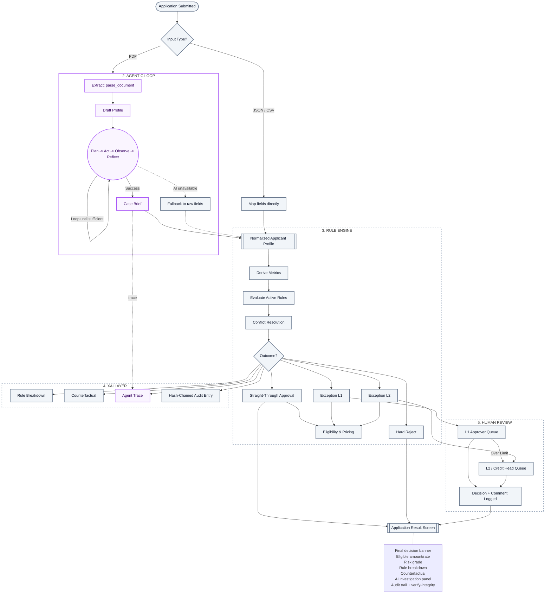

# Product Requirements Document (PRD): Configurable BRE & XAI Engine

This document serves as the absolute source of truth for implementing the Decision Engine (Layer 2) and the Explainability Engine (Layer 3/4) in Python. 

## 1. End-to-End Underwriting Pipeline (Flowchart)

Below is the architectural flow of the entire application, distinguishing strictly between deterministic systems (Gray) and AI-involved systems (Purple).

---

## 2. Rule Categories (The Synthetic Policy)
This is the actual policy the BRE will execute, evaluated sequentially.

**1. Hard-Reject Gates (Checked first, overrides everything)**
- `Fraud/blacklist flag == true` → REJECT
- `writeOffFlag == true` OR `settlementFlag == true` → REJECT
- `DPD 90+ in last 6 months` → REJECT
- `bureauScore < 550` → REJECT (Absolute floor, no compensating factors)

**2. Eligibility Gates**
- `age < 21 OR age > 60` (at maturity) → INELIGIBLE
- `businessVintage < 6` (salaried months) OR `< 24` (self-employed months) → INELIGIBLE (unless compensating factor)
- `declaredIncome < 15000` → INELIGIBLE

**3. Repayment Capacity — FOIR**
*(FOIR = (existingObligations + proposed EMI) / declaredIncome)*
- `FOIR <= 0.40` (40%) → PASS
- `FOIR > 0.40 AND <= 0.55` → BORDERLINE (Routes to Exception or needs Asset compensation)
- `FOIR > 0.55` → REJECT (Unless liquid assets cover loan multiple)

**4. Bureau/Credit Behavior**
- Score Bands: `≥750` (Excellent) | `700–749` (Good) | `650–699` (Fair / Exception Eligible) | `550–649` (Weak / L2 Exception Only)
- `enquiries > 4` (in 3 months) → FLAG (Over-leveraging)
- `overdueAmount > 10000` → FLAG

**5. Bank Statement Behavior**
- `bounceCount`: `0` (Clean) | `1-2` (Borderline) | `3+` (Reject/Exception)
- `cashFlowVolatility > 0.4` → FLAG
- `bankAvgBalance < (1x proposed EMI)` → FLAG

**6. Income Trend (ITR)**
- `incomeTrend` YoY decline `> 20%` → FLAG (pushes to exception)

**7. Assets (The Compensating Lever)**
- `declaredAssets >= (0.5 * requestedLoanAmount)` → Moves borderline FOIR/Bureau from Reject to Exception. (Does NOT override Hard-Reject gates).

**8. Loan Sizing & Pricing**
- `eligibleAmount` = `min(income_multiplier * annual_income, asset_cap, requestedLoanAmount)`
- `riskGrade` (A-E composite of bureau + FOIR + bounce) maps to interest rate band.

---

## 3. Engine Execution Flow (Chain of Thought)
How the engine processes a single applicant inside `engine.py`.

1. **Normalize**: Map inputs to `NormalizedApplicantProfile`. If missing critical field (e.g., no bureau score), short-circuit to `Insufficient Data`.
2. **Compute Derived Metrics**: Calculate FOIR, income trend, average balance, etc.
3. **Evaluate Hard-Reject Gates**: If any trigger -> `Hard Reject`. STOP execution. Eligibility/Pricing rules do not run.
4. **Evaluate Eligibility Gates**: If fail -> `Reject` or `Insufficient Data`.
5. **Evaluate Scoring Rules**: Run Bureau, FOIR, Bounce, Trend, Asset rules. **Log every single rule** (pass/fail/severity). Do not short circuit here.
6. **Aggregate Outcomes**: 
   - All rules safe -> `Straight-through Approval`.
   - Any borderline deviation -> `Exception Required`.
7. **Exception Assignment**: 
   - 1 deviation -> `Exception L1`.
   - 2+ deviations OR Loan Amount > Cap -> `Exception L2`.
8. **Loan Sizing & Pricing**: Computed based on Risk Grade (only for non-hard-rejects).
9. **Persist Trace**: Output an array of all evaluated rules (id, condition, threshold, value, pass/fail, reason code).

---

## 4. The Explainability Engine (XAI Layer)
**CRITICAL CONSTRAINT**: The AI Explanation Layer *never decides anything*. It is a pure function that reads the deterministic trace from Step 9 and narrates it.

- **Output 1 (Narrative)**: Generates human-readable text explaining the rejection or exception. (e.g., *"Rejected. Bureau score 640 is below the 650 minimum..."*)
- **Output 2 (Factor Ranking)**: Ranks rules by configured severity weights (not a black-box model).
- **Output 3 (Counterfactual)**: Re-runs the deterministic engine with small input perturbations. (e.g., *"Approved if income were ₹8,000 higher"*).
- **Output 4 (Exception Memo)**: For L1/L2 approvers. Synthesizes the trace into a 1-paragraph recommendation.
